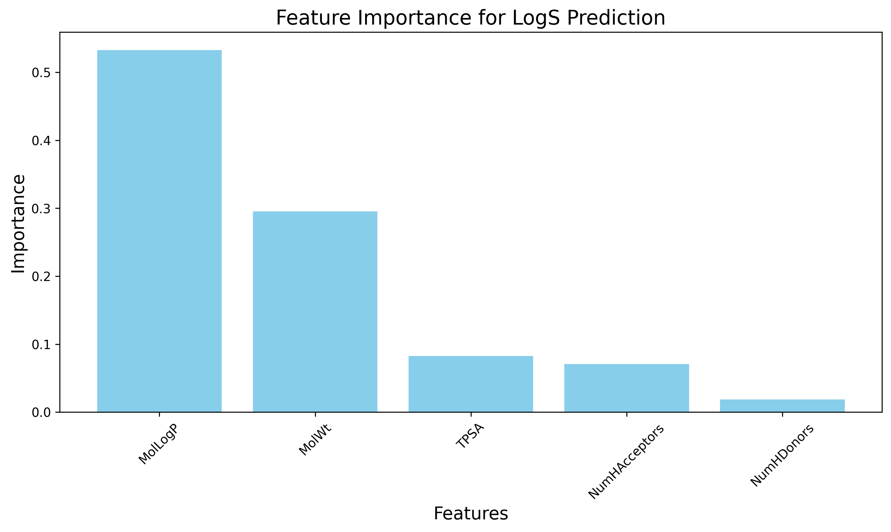

# Cheminformatics-Solubility-Prediction
This repository contains a Python-based machine learning project that predicts the aqueous solubility of small molecules from their chemical structure. The entire workflow, from data acquisition to model interpretation, is documented in the accompanying Jupyter/Colab notebook.

1. Executive Summary
This project aimed to predict the aqueous solubility (LogS) of small molecules using their structural properties. A Random Forest Regressor model was developed, achieving a final R-squared of ~0.89 on unseen test data. The model identified hydrophobicity (MolLogP) and molecular weight (MolWt) as the most critical features for prediction, demonstrating the potential of machine learning to create accurate and interpretable models for ADMET property prediction in early-stage drug discovery.

2. Introduction
Background
In pharmaceutical sciences, ADMET (Absorption, Distribution, Metabolism, Excretion, and Toxicity) properties are fundamental to a drug's success. A compound may have excellent efficacy in a lab setting, but it will fail as a therapeutic if it isn't absorbed by the body, is too toxic, or is cleared before it can act. Aqueous solubility is one of the most important of these properties, directly influencing a drug's absorption and distribution. Poor solubility is a primary reason for high failure rates in the drug discovery pipeline.

Objective
The goal of this project is to build a robust machine learning model that can accurately predict a molecule's aqueous solubility (LogS) directly from its 2D chemical structure. By creating such a model, we can perform in silico (computational) screening of large chemical libraries to identify promising drug candidates early, saving significant time and resources.

3. Data and Methods
Data Source
The model was trained on the well-known aqueous solubility dataset published by John S. Delaney (2004). The dataset contains 1144 diverse small molecules, each with an experimentally measured log(solubility in mols/L) value and a corresponding SMILES (Simplified Molecular-Input Line-Entry System) string representing its 2D structure.

Feature Engineering
A machine learning model requires numerical input. We used the RDKit library in Python to convert each molecule's SMILES string into a set of five chemically-relevant numerical features, also known as molecular descriptors:

MolWt: Molecular Weight, a measure of the molecule's size.
MolLogP: The octanol-water partition coefficient, a measure of hydrophobicity.
TPSA: Topological Polar Surface Area, a measure of a molecule's polarity.
NumHDonors: The number of hydrogen bond donors.
NumHAcceptors: The number of hydrogen bond acceptors.
Model Development
The dataset was split into a training set (80%) and a testing set (20%). The model learns from the training data, while the test data is held back for final, unbiased evaluation.

We chose a Random Forest Regressor as our model. This is a powerful ensemble algorithm that builds multiple decision trees and merges their outputs. It is well-suited for this task because it can capture complex, non-linear relationships between chemical features and solubility, is robust to overfitting, and can provide feature importance scores.

Model Optimization
Our initial baseline model performed well but showed signs of overfitting, with a training R² (0.979) significantly higher than its testing R² (0.896). To address this, we performed hyperparameter tuning using Scikit-learn's GridSearchCV. This process systematically tested various model configurations (e.g., number of trees, tree depth) with 5-fold cross-validation to find the optimal set of hyperparameters that produced a more generalized and robust model.

4. Results
Final Model Performance
After hyperparameter tuning, our final model achieved a strong predictive performance on the unseen test data with an R-squared of 0.894 and a Root Mean Squared Error (RMSE) of 0.681. The scatter plot below visually confirms the model's accuracy, showing a strong correlation between the actual and predicted LogS values.

Feature Importance
A key output of the model is the importance of each feature in making predictions. The results align perfectly with fundamental chemical principles.

Feature	Importance
MolLogP	53.3%
MolWt	29.5%
TPSA	8.2%
NumHAcceptors	7.1%
NumHDonors	1.9%

MolLogP (hydrophobicity) and MolWt (size) are the dominant factors, confirming that solubility is primarily driven by how "greasy" and large a molecule is. Polarity features (TPSA, H-bond donors/acceptors) play a smaller but still significant role.

5. Discussion and Conclusion
Implications for Drug Development
A model like this is a powerful tool for drug discovery. It can be used to perform virtual screening on libraries of millions of candidate molecules, rapidly filtering out compounds predicted to have poor solubility. This allows medicinal chemists to focus their limited lab time and resources on synthesizing and testing only the most promising candidates, thereby accelerating the discovery pipeline and reducing costs.

Limitations and Future Work
Limitations: The model's accuracy is dependent on the chemical space of the training data. The feature set used was small and basic.
Future Work: The model could be improved by training on a larger, more diverse dataset. Incorporating more advanced features, such as molecular fingerprints or 3D descriptors, could capture more subtle structural information. Exploring other algorithms, such as Gradient Boosting or Graph Neural Networks, may also yield performance gains.
Conclusion
This project successfully demonstrated the end-to-end development of a Quantitative Structure-Activity Relationship (QSAR) model for a critical ADMET property. We created a machine learning model that is not only accurate but also interpretable, providing valuable insights that align with established chemical knowledge and can aid in the design of better drugs.
